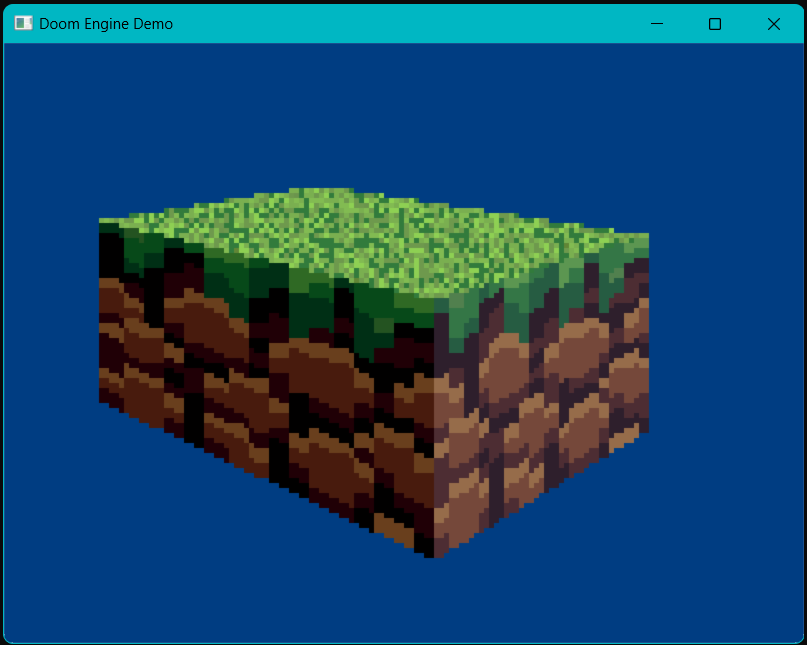

# Doom Engine Demo
This project aimed to recreate the distinctive 3D aesthetic of classic games like Doom (1993) using modern programming techniques. By leveraging the OpenGL and GLUT libraries in C++, I developed a pixel-based 3D graphic engine using a algorithm to create a convincing 3D perspective in a 2D space.

## Key Techniques:
+ Pixel-Based Rendering: The engine renders scenes pixel by pixel, creating a distinctive retro aesthetic.
+ GLUT and OpenGL: I leveraged the GLUT library for window creation, event handling, and OpenGL for 2D graphics primitives and rendering.
+ 3D Mathematics: A deep understanding of 3D mathematics, including matrix transformations, projections, and lighting, was essential to create the illusion of depth and perspective.
+ C++ Implementation: The engine is built entirely in C++ with low-level graphics concepts.
+ 2D to 3D Algorithm logic: The algorithm involves defining walls as pairs of points, normalizing their coordinates, and projecting them onto the screen. By connecting these walls to form sectors and rendering them with vertical lines which simulates depth and creates a retro-style 3D environment.

## Screenshots

## License
[MIT](https://choosealicense.com/licenses/mit/)
